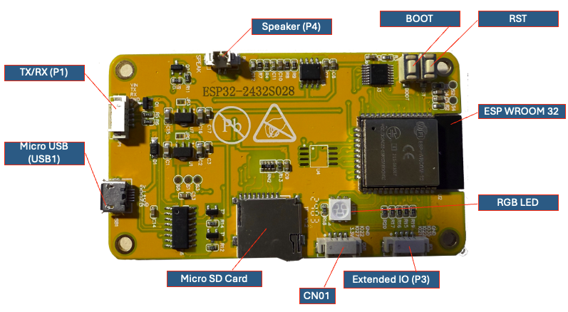
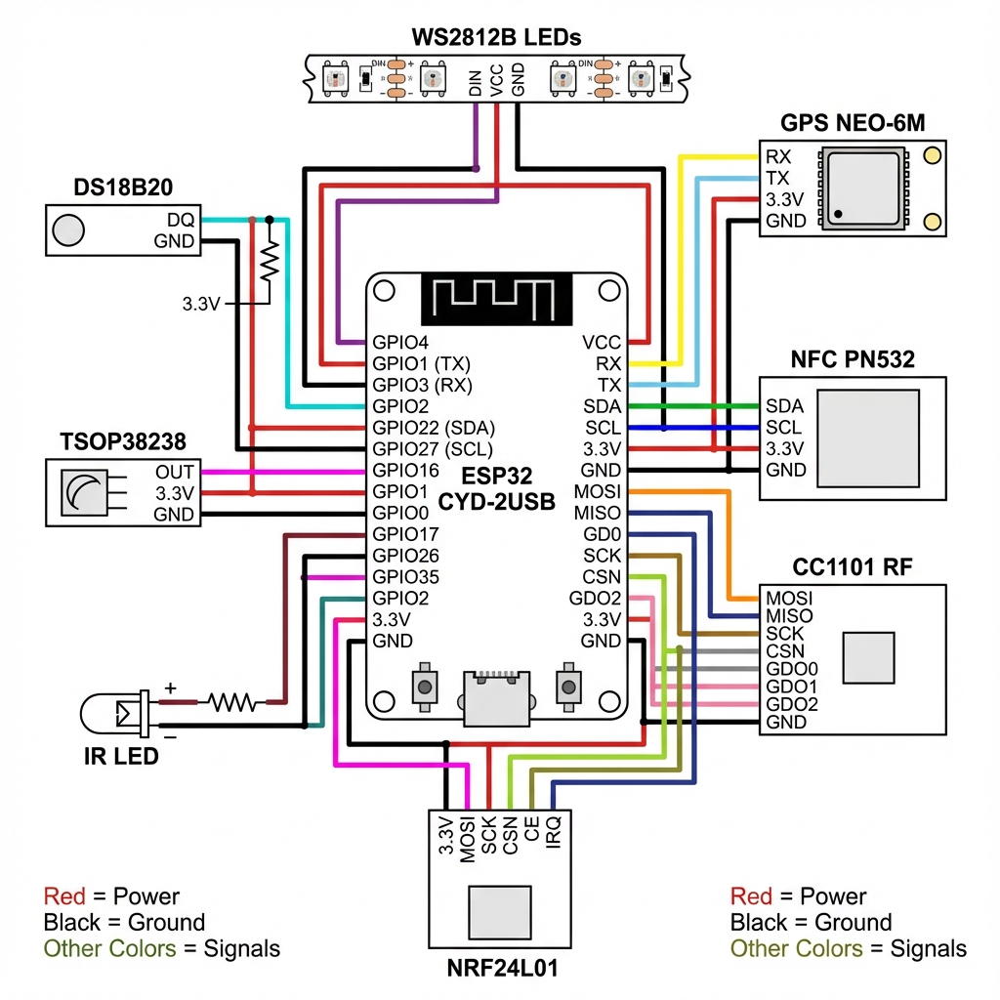
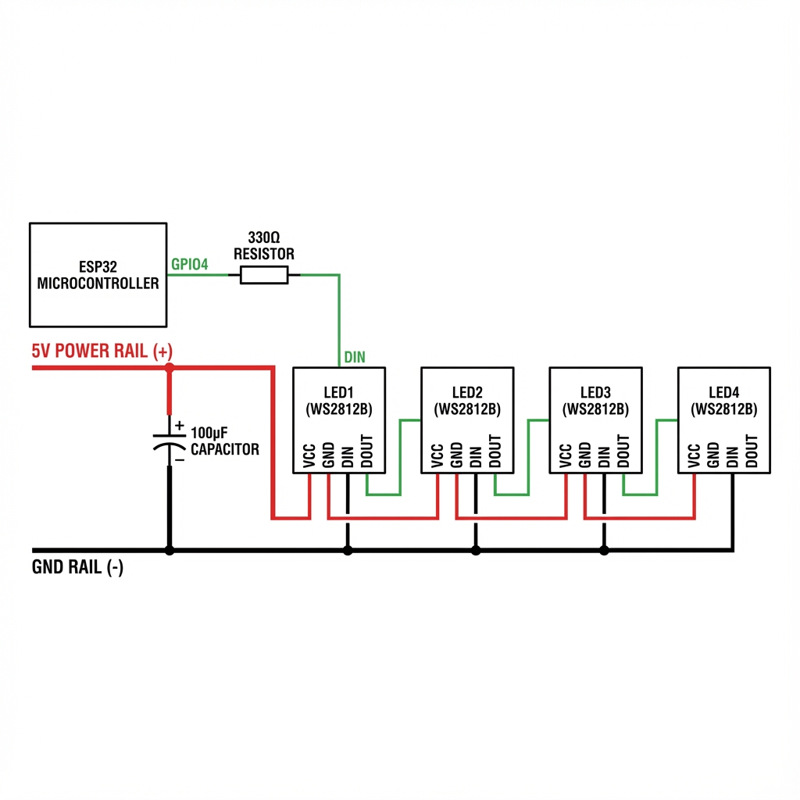
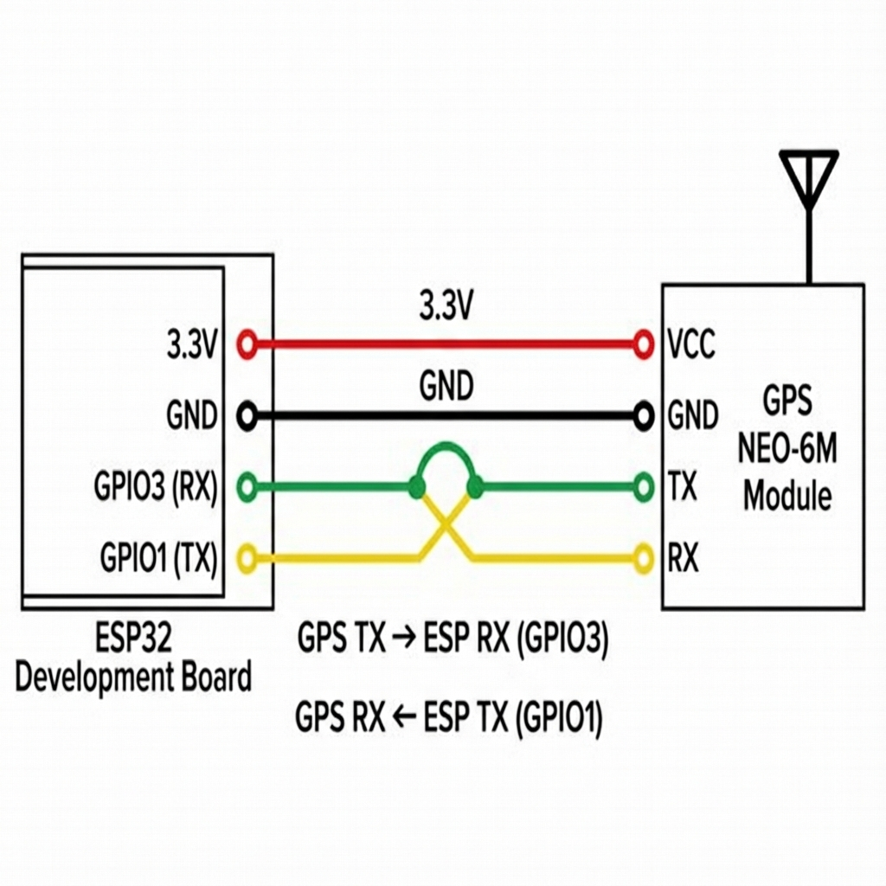
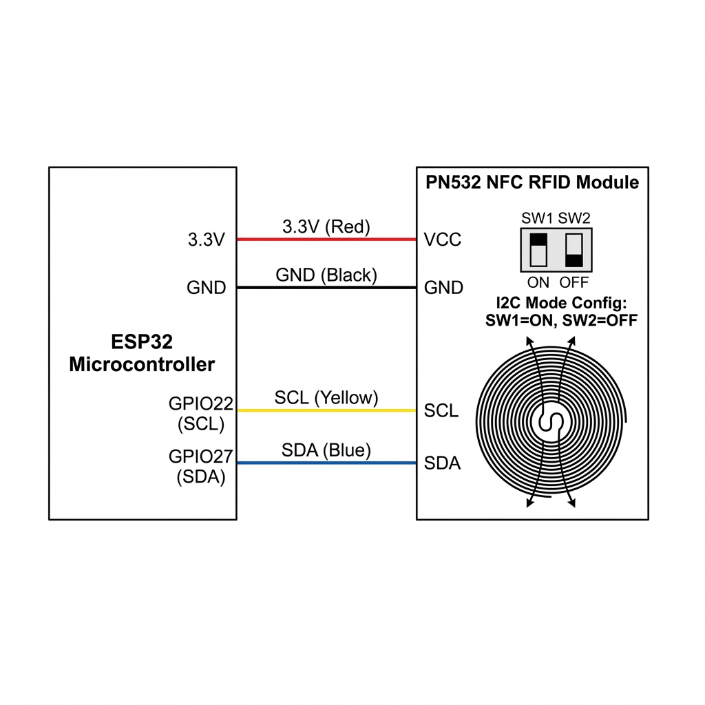
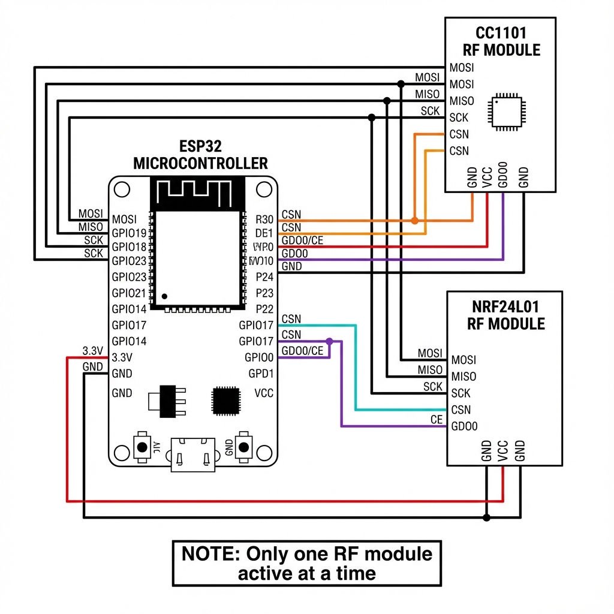
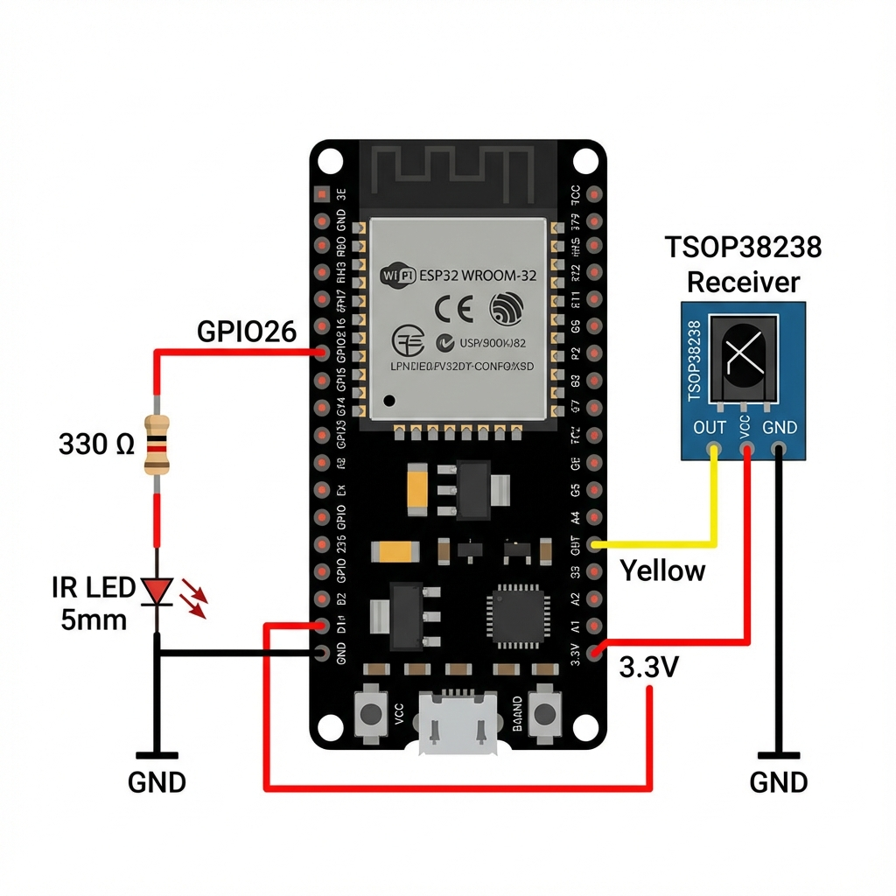
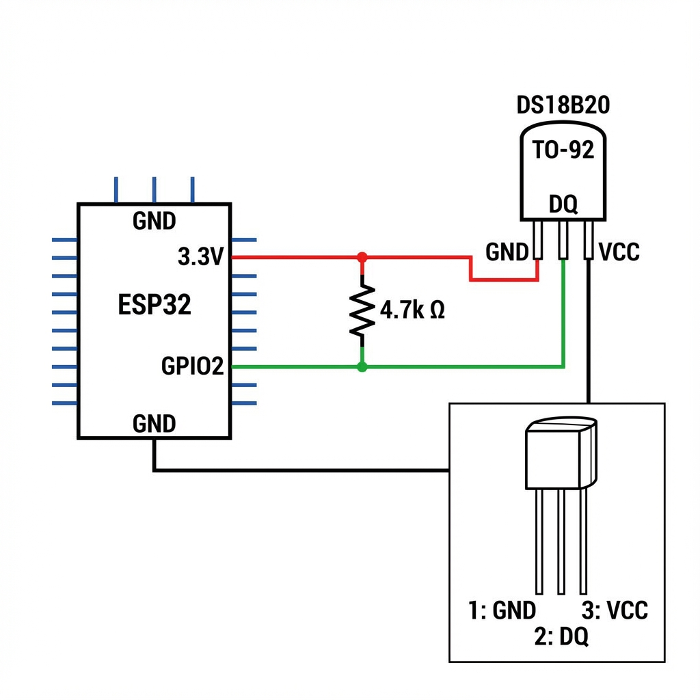

# 🔧 Guia COMPLETO de Montagem - CYD-2USB "Lele Origin"

> **📖 Este guia foi feito para QUALQUER pessoa conseguir montar, mesmo sem experiência em eletrônica!**

Cada passo tem explicações detalhadas, fotos e diagramas. Siga com calma e você consegue! 🚀

---

## 📦 O Que Você Vai Precisar

### Módulos Eletrônicos

| # | Componente | Quantidade | Para Que Serve |
|---|------------|:----------:|----------------|
| 1 | **LED WS2812B** | 4 | LEDs coloridos RGB controlados individualmente |
| 2 | **GPS Neo-6M** | 1 | Localização por satélite (latitude/longitude) |
| 3 | **NFC PN532** | 1 | Ler e escrever cartões RFID/NFC |
| 4 | **CC1101** | 1 | Rádio 433MHz (controles remotos) |
| 5 | **NRF24L01** | 1 | Rádio 2.4GHz (dispositivos wireless) |
| 6 | **LED IR 5mm** | 1 | Transmitir infravermelho (controlar TVs) |
| 7 | **TSOP38238** | 1 | Receber infravermelho (capturar controles) |
| 8 | **DS18B20** | 1 | Sensor de temperatura |

### Componentes Pequenos (Passivos) - LISTA COMPLETA

> **🛡️ Estes componentes protegem, estabilizam e otimizam o funcionamento dos módulos!**

#### Resistores

| # | Valor | Qtd | Para Que Serve | Onde Usar |
|---|-------|:---:|----------------|-----------|
| 1 | **330Ω** 1/4W | 2 | Limitar corrente | LED IR + linha dados WS2812B |
| 2 | **4.7kΩ** 1/4W | 1 | Pull-up 1-Wire | DS18B20 (DQ ↔ VCC) |
| 3 | **10kΩ** 1/4W | 2 | Pull-up I2C | NFC SDA + SCL (opcional, melhora estabilidade) |
| 4 | **1kΩ** 1/4W | 2 | Proteção GPIO | Linhas de dados sensíveis |

#### Capacitores de Desacoplamento (CRÍTICOS para RF!)

| # | Valor | Tipo | Qtd | Para Que Serve | Onde Usar |
|---|-------|------|:---:|----------------|-----------|
| 5 | **100nF (0.1µF)** | Cerâmico | 5 | Filtrar ruído alta frequência | VCC de cada módulo |
| 6 | **10µF** | Cerâmico/Eletrolítico | 3 | Estabilizar alimentação | CC1101, NRF24, PN532 |
| 7 | **100µF** | Eletrolítico | 2 | Reserva de energia | WS2812B + NRF24 PA/LNA |
| 8 | **1000µF** | Eletrolítico | 1 | Reserva principal | Entrada de alimentação |

#### Proteção ESD e Surtos

| # | Componente | Valor | Qtd | Para Que Serve | Onde Usar |
|---|------------|-------|:---:|----------------|-----------|
| 9 | **Diodo TVS** | 3.3V bidirectional | 2 | Proteção contra surtos | Linhas I2C (SDA/SCL) |
| 10 | **Diodo TVS** | 5V bidirectional | 1 | Proteção contra surtos | Entrada 5V |
| 11 | **Diodo Schottky** | 1N5817 (1A) | 1 | Proteção polaridade reversa | Entrada bateria |
| 12 | **Ferrite Bead** | 100Ω @ 100MHz | 3 | Filtrar EMI | VCC dos rádios |

#### Proteção de Sobrecorrente

| # | Componente | Valor | Qtd | Para Que Serve | Onde Usar |
|---|------------|-------|:---:|----------------|-----------|
| 13 | **Fusível PTC** | 500mA resettable | 1 | Proteção curto-circuito | Entrada principal |
| 14 | **Fusível PTC** | 200mA resettable | 2 | Proteção módulos | CC1101 + NRF24 |

#### Componentes para IR (Potência Extra)

| # | Componente | Valor | Qtd | Para Que Serve | Onde Usar |
|---|------------|-------|:---:|----------------|-----------|
| 15 | **Transistor NPN** | 2N2222 ou BC547 | 1 | Driver de potência | LED IR (alcance maior) |
| 16 | **Resistor base** | 1kΩ | 1 | Limitar corrente base | Transistor IR |
| 17 | **Resistor LED** | 10Ω 1W | 1 | Alta potência IR | LED IR (com transistor) |

### Ferramentas

- Ferro de solda (25W a 40W)
- Solda (60/40 ou sem chumbo)
- Fios (cores variadas recomendado)
- Multímetro (opcional, mas útil)
- Pinça
- Óculos de proteção

---

## 🗺️ Conheça Sua Placa CYD-2USB

Antes de começar, identifique os conectores da placa:



### Conectores da Placa

| Conector | Nome | O Que Tem |
|----------|------|-----------|
| **P1** | TX/RX (Serial) | VIN, TX (GPIO 1), RX (GPIO 3), GND |
| **P3** | Extended IO | GND, IO35, IO22, IO21 |
| **CN01** | Expansion | GND, IO22, IO27, 3.3V |
| **P4** | Speaker | Saída de áudio |
| **SD Card** | Micro SD | IO5 (CS), IO23 (MOSI), IO18 (SCK), IO19 (MISO) |
| **RGB LED** | LEDs Nativos | IO17 (R), IO4 (G), IO16 (B) |
| **USB1** | Micro USB | Programação e alimentação |

---

## 🗺️ Mapa Geral das Conexões

Diagrama completo de como tudo se conecta:



> **💡 Dica:** Imprima este diagrama e marque cada conexão que você fizer!

---

## 📌 Tabela Mestra de Pinagem

Guarde esta tabela! Ela mostra EXATAMENTE onde cada fio vai:

| Módulo | Pino do Módulo | GPIO | Conector na Placa | Cor Sugerida |
|--------|----------------|:----:|:----------------:|:------------:|
| **WS2812B** | DIN | **4** | **RGB LED (G)** | 🟢 Verde |
| **WS2812B** | VCC | **5V** | **P1 (VIN)** | 🔴 Vermelho |
| **WS2812B** | GND | **GND** | **P1 ou CN01** | ⚫ Preto |
| **GPS** | TX | **3** | **P1 (RX)** | 🟡 Amarelo |
| **GPS** | RX | **1** | **P1 (TX)** | 🟠 Laranja |
| **GPS** | VCC | **3.3V** | **CN01 (3.3V)** | 🔴 Vermelho |
| **GPS** | GND | **GND** | **P1 (GND)** | ⚫ Preto |
| **NFC** | SDA | **27** | **CN01 (IO27)** | 🔵 Azul |
| **NFC** | SCL | **22** | **CN01 (IO22)** | 🟡 Amarelo |
| **NFC** | VCC | **3.3V** | **CN01 (3.3V)** | 🔴 Vermelho |
| **NFC** | GND | **GND** | **CN01 (GND)** | ⚫ Preto |
| **CC1101** | CSN | **16** | **RGB LED (B)** | 🟠 Laranja |
| **CC1101** | GDO0 | **0** | **Botão BOOT** | 🟣 Roxo |
| **CC1101** | MOSI | **23** | **SD Card (CMD)** | 🟢 Verde |
| **CC1101** | MISO | **19** | **SD Card (DAT0)** | 🔵 Azul |
| **CC1101** | SCK | **18** | **SD Card (CLK)** | 🟡 Amarelo |
| **CC1101** | VCC | **3.3V** | **CN01 (3.3V)** | 🔴 Vermelho |
| **CC1101** | GND | **GND** | **CN01 (GND)** | ⚫ Preto |
| **NRF24** | CSN | **17** | **RGB LED (R)** | 🩵 Ciano |
| **NRF24** | CE | **0** | **Botão BOOT** | 🟣 Roxo |
| **NRF24** | MOSI | **23** | **SD Card (CMD)** | 🟢 Verde |
| **NRF24** | MISO | **19** | **SD Card (DAT0)** | 🔵 Azul |
| **NRF24** | SCK | **18** | **SD Card (CLK)** | 🟡 Amarelo |
| **NRF24** | VCC | **3.3V** | **CN01 (3.3V)** | 🔴 Vermelho |
| **NRF24** | GND | **GND** | **CN01 (GND)** | ⚫ Preto |
| **IR LED** | Anodo (+) | **26** | **P4 (Audio)** | 🟢 Verde |
| **IR LED** | Catodo (-) | **GND** | **P1 ou CN01** | ⚫ Preto |
| **TSOP38238** | OUT | **35** | **P3 (IO35)** | 🟡 Amarelo |
| **TSOP38238** | VCC | **3.3V** | **CN01 (3.3V)** | 🔴 Vermelho |
| **TSOP38238** | GND | **GND** | **P3 (GND)** | ⚫ Preto |
| **DS18B20** | DQ | **2** | **Chip ESP32** | 🟢 Verde |
| **DS18B20** | VCC | **3.3V** | **CN01 (3.3V)** | 🔴 Vermelho |
| **DS18B20** | GND | **GND** | **CN01 (GND)** | ⚫ Preto |

---

# 🔌 MÓDULO 1: LEDs WS2812B (RGB Endereçáveis)

## O Que São?

Os LEDs WS2812B são LEDs inteligentes que podem mostrar QUALQUER cor individualmente. Você vai ligar 4 deles em série (um atrás do outro).

## Onde Conectar na Placa

```
┌─────────────────────────────────────────────────────────────┐
│                       PLACA CYD-2USB                        │
│                                                             │
│   ┌─────┐                                     ┌─────────┐   │
│   │ P1  │                                     │ RGB LED │   │
│   │ VIN │◄── 5V dos LEDs                      │ IO4 (G) │◄──┼── DIN (via 330Ω)
│   │ TX  │                                     │ IO16(B) │   │
│   │ RX  │                                     │ IO17(R) │   │
│   │ GND │◄── GND dos LEDs                     └─────────┘   │
│   └─────┘                                                   │
└─────────────────────────────────────────────────────────────┘
```

## Diagrama de Conexão



## Passo a Passo

### Passo 1.1: Entenda os Pinos do LED

Cada LED WS2812B tem 4 pinos:

```
┌─────────────────────────┐
│       WS2812B LED       │
│                         │
│   VCC   DOUT   GND   DIN│
│    │      │     │     │ │
│   5V   Saída  Terra Entrada
│  (força) (pro  (-)   (dados
│          próximo)     entram)
└─────────────────────────┘
```

> **⚠️ IMPORTANTE:** DIN = Dados ENTRAM | DOUT = Dados SAEM para o próximo LED

### Passo 1.2: Monte a Cadeia

Você vai ligar os 4 LEDs assim:

```
ESP32                LED 1           LED 2           LED 3           LED 4
GPIO 4 ──[330Ω]────► DIN             DIN             DIN             DIN
(RGB LED G)           │               │               │               │
                    DOUT ───────────► │               │               │
                                    DOUT ───────────► │               │
                                                    DOUT ───────────► │
                                                                    DOUT (vazio)
```

### Passo 1.3: Solde na Ordem

1. **Primeiro:** Encontre o conector **RGB LED** na placa (lado direito)
2. **Segundo:** Solde um fio VERDE no pino **G (GPIO 4)**
3. **Terceiro:** Coloque o resistor de 330Ω na ponta desse fio
4. **Quarto:** Solde a outra ponta do resistor no pino DIN do LED 1
5. **Quinto:** Solde um fio curto do DOUT do LED 1 para o DIN do LED 2
6. **Sexto:** Repita para LED 2 → LED 3 → LED 4
7. **Sétimo:** O DOUT do LED 4 fica VAZIO (não conecte nada)

### Passo 1.4: Conecte a Alimentação

Use o conector **P1** para a alimentação:

```
P1 (VIN = 5V) ──┬───┬───┬───┐
                │   │   │   │
               VCC VCC VCC VCC
               LED1 LED2 LED3 LED4
               GND GND GND GND
                │   │   │   │
P1 (GND) ───────┴───┴───┴───┘
```

### Passo 1.5: Capacitor de Estabilidade

Coloque o capacitor de 100µF entre 5V e GND perto do primeiro LED:

```
P1 VIN (5V) ─────┬───────► VCC dos LEDs
                 │
                [+]
                [C] 100µF  (a perna MAIOR é o +)
                [-]
                 │
P1 GND ──────────┴───────► GND dos LEDs
```

> **⚠️ ATENÇÃO:** O capacitor tem polaridade! A perna MAIOR vai no 5V, a menor no GND.

## ✅ Checklist do Módulo 1

- [ ] Fio do **RGB LED pino G (IO4)** via resistor 330Ω para primeiro LED
- [ ] Cadeia DIN → DOUT conectada entre os 4 LEDs
- [ ] Todos os VCC ligados em **P1 VIN (5V)**
- [ ] Todos os GND ligados em **P1 GND**
- [ ] Capacitor 100µF instalado (perna maior no 5V)

---

# 🛰️ MÓDULO 2: GPS Neo-6M

## O Que É?

O GPS Neo-6M recebe sinais de satélite e informa sua localização (latitude, longitude, altitude, velocidade).

## Onde Conectar na Placa

O GPS usa o conector **P1 (TX/RX)** que fica na lateral esquerda:

```
┌─────────────────────────────────────────────────────────────┐
│                       PLACA CYD-2USB                        │
│                                                             │
│   ┌─────────┐                                               │
│   │   P1    │                                               │
│   │ ┌─────┐ │                                               │
│   │ │ VIN │ │ ← (não usar para GPS, use CN01 3.3V)          │
│   │ │ TX  │ │ ← GPIO 1 → GPS RX (Laranja)                  │
│   │ │ RX  │ │ ← GPIO 3 → GPS TX (Amarelo)                  │
│   │ │ GND │ │ ← GND → GPS GND (Preto)                      │
│   │ └─────┘ │                                               │
│   └─────────┘                                               │
│                                                             │
│   ┌──────────┐                                              │
│   │   CN01   │                                              │
│   │  (3.3V)  │ ← GPS VCC (Vermelho)                        │
│   └──────────┘                                              │
└─────────────────────────────────────────────────────────────┘
```

## Diagrama de Conexão



## Passo a Passo

### Passo 2.1: Entenda os Pinos do GPS

O módulo tem 4 pinos:

```
┌─────────────────────────┐
│      GPS Neo-6M         │
│                         │
│     [ANTENA CERÂMICA]   │
│                         │
│   VCC   RX   TX   GND   │
│    │    │    │     │    │
│  3.3V  Recebe Envia Terra
│        dados  dados
└─────────────────────────┘
```

### Passo 2.2: Conexão CRUZADA (Muito Importante!)

> **🔴 REGRA DE OURO:** TX de um vai no RX do outro!

```
GPS                     Placa CYD (P1)
─────                   ───────────────
TX  ───────────────────► P1 RX (GPIO 3) ← O GPS ENVIA, o ESP RECEBE
RX  ◄───────────────────  P1 TX (GPIO 1) ← O ESP ENVIA, o GPS RECEBE
```

### Passo 2.3: Solde os Fios

| GPS | Fio | Conector na Placa |
|-----|-----|-------------------|
| VCC | 🔴 Vermelho | **CN01 pino 3.3V** |
| GND | ⚫ Preto | **P1 pino GND** |
| TX | 🟡 Amarelo | **P1 pino RX** |
| RX | 🟠 Laranja | **P1 pino TX** |

## ✅ Checklist do Módulo 2

- [ ] VCC do GPS em **CN01 (3.3V)** - NÃO use 5V!
- [ ] GND conectado em **P1 (GND)**
- [ ] TX do GPS → **P1 RX (GPIO 3)**
- [ ] RX do GPS → **P1 TX (GPIO 1)**

---

# 💳 MÓDULO 3: NFC PN532

## O Que É?

O PN532 lê e escreve cartões NFC/RFID como cartões de ônibus, crachás, tags, etc.

## Onde Conectar na Placa

O NFC usa o conector **CN01** que fica na parte inferior da placa:

```
┌─────────────────────────────────────────────────────────────┐
│                       PLACA CYD-2USB                        │
│                                                             │
│                                                             │
│                      ┌─────────────────┐                    │
│                      │      CN01       │                    │
│                      │ ┌─────────────┐ │                    │
│                      │ │ GND         │ │ ← NFC GND         │
│                      │ │ IO22 (SCL)  │ │ ← NFC SCL         │
│                      │ │ IO27 (SDA)  │ │ ← NFC SDA         │
│                      │ │ 3.3V        │ │ ← NFC VCC         │
│                      │ └─────────────┘ │                    │
│                      └─────────────────┘                    │
└─────────────────────────────────────────────────────────────┘
```

## Diagrama de Conexão



## Passo a Passo

### Passo 3.1: Configure o Modo I2C

O PN532 pode funcionar de 3 modos. Vamos usar I2C.

**Procure os DIP Switches no módulo e configure:**

```
┌─────────────────────┐
│     DIP Switches    │
│   ┌───┬───┐         │
│   │ 1 │ 2 │         │
│   ├───┼───┤         │
│   │ON │OFF│  ← Configure assim!
│   └───┴───┘         │
└─────────────────────┘

SW1 = ON  (para cima)
SW2 = OFF (para baixo)
```

### Passo 3.2: Solde os Fios no CN01

| NFC | Fio | Pino no CN01 |
|-----|-----|--------------|
| VCC | 🔴 Vermelho | **3.3V** |
| GND | ⚫ Preto | **GND** |
| SDA | 🔵 Azul | **IO27** |
| SCL | 🟡 Amarelo | **IO22** |

## ✅ Checklist do Módulo 3

- [ ] DIP Switches: SW1=ON, SW2=OFF
- [ ] VCC em **CN01 (3.3V)**
- [ ] GND em **CN01 (GND)**
- [ ] SDA → **CN01 (IO27)**
- [ ] SCL → **CN01 (IO22)**

> [!NOTE]
> **Para ESP32-S3**: Use GPIO 1 (SDA) e GPIO 2 (SCL) com pull-ups 4.7K.
> Power gating via MOSFET GPIO 42 para economia de energia.
> Documentação completa: [PN532_NFC_MODULE_V3.md](file:///c:/Users/leleb/OneDrive/Desktop/Esp32-S3/docs/PN532_NFC_MODULE_V3.md)

---

# 📻 MÓDULOS 4 e 5: CC1101 e NRF24L01 (Rádios)

## O Que São?

- **CC1101:** Rádio 433MHz para controles remotos, portões, alarmes
- **NRF24L01:** Rádio 2.4GHz para mouses, teclados, drones

## Onde Conectar na Placa

Os rádios usam o **barramento SPI** que é compartilhado com o **Slot SD Card**:

```
┌─────────────────────────────────────────────────────────────┐
│                       PLACA CYD-2USB                        │
│                                                             │
│   ┌─────────────────────────┐          ┌─────────────┐      │
│   │      MICRO SD CARD      │          │   RGB LED   │      │
│   │  ┌───────────────────┐  │          │ ┌─────────┐ │      │
│   │  │ CLK  = IO18 (SCK) │  │          │ │ R = IO17│ │ ← NRF CSN
│   │  │ CMD  = IO23 (MOSI)│  │          │ │ G = IO4 │ │      │
│   │  │ DAT0 = IO19 (MISO)│  │          │ │ B = IO16│ │ ← CC1101 CSN
│   │  │ DAT3 = IO5 (CS)   │  │          │ └─────────┘ │      │
│   │  └───────────────────┘  │          └─────────────┘      │
│   └─────────────────────────┘                               │
│                                                             │
│   ┌──────────┐                                              │
│   │  BOOT    │ ← GPIO 0 (GDO0/CE compartilhado)            │
│   └──────────┘                                              │
│                                                             │
│   ┌──────────┐                                              │
│   │   CN01   │ ← 3.3V e GND para os rádios                 │
│   └──────────┘                                              │
└─────────────────────────────────────────────────────────────┘
```

## Diagrama de Conexão



## ⚠️ IMPORTANTE: Compartilhamento de Pinos

Os dois módulos compartilham o mesmo barramento SPI. Isso significa:

- **MOSI, MISO, SCK** são os mesmos para ambos (pinos do SD Card)
- **CSN é diferente** para cada um (IO16 para CC1101, IO17 para NRF)
- **GDO0/CE compartilham GPIO 0** (botão BOOT)

> **🔴 REGRA:** Você NÃO pode usar CC1101 e NRF24 ao mesmo tempo. O software escolhe qual está ativo!

## Passo a Passo

### Passo 4.1: Conexões do CC1101

| Pino CC1101 | GPIO | Onde Soldar na Placa |
|-------------|:----:|----------------------|
| VCC | 3.3V | **CN01 (3.3V)** |
| GND | GND | **CN01 (GND)** |
| MOSI | 23 | **SD Card slot - pino CMD** |
| MISO | 19 | **SD Card slot - pino DAT0** |
| SCK | 18 | **SD Card slot - pino CLK** |
| CSN | 16 | **RGB LED - pino B (azul)** |
| GDO0 | 0 | **Botão BOOT** |

### Passo 4.2: Conexões do NRF24L01

| Pino NRF24 | GPIO | Onde Soldar na Placa |
|------------|:----:|----------------------|
| GND | GND | **CN01 (GND)** |
| VCC | 3.3V | **CN01 (3.3V)** |
| CE | 0 | **Botão BOOT** |
| CSN | 17 | **RGB LED - pino R (vermelho)** |
| SCK | 18 | **SD Card slot - pino CLK** |
| MOSI | 23 | **SD Card slot - pino CMD** |
| MISO | 19 | **SD Card slot - pino DAT0** |
| IRQ | - | (não conectar) |

### Passo 4.3: Dica de Soldagem no SD Card

Para acessar os pinos do SD Card:

```
Olhando o slot SD Card de frente (com a abertura para cima):

       ┌───────────────────────────┐
       │    Abertura do cartão    │
       │                           │
       │  ┌─┐ ┌─┐ ┌─┐ ┌─┐ ┌─┐ ┌─┐ │
       │  │8│ │7│ │6│ │5│ │4│ │3│ │  (pinos atrás do slot)
       │  └─┘ └─┘ └─┘ └─┘ └─┘ └─┘ │
       └───────────────────────────┘

Você pode soldar nos pinos que saem atrás do slot:
- CLK (IO18) = SCK dos rádios
- CMD (IO23) = MOSI dos rádios
- DAT0 (IO19) = MISO dos rádios
```

## ✅ Checklist dos Módulos 4-5

### CC1101

- [ ] CSN → **RGB LED pino B (IO16)**
- [ ] GDO0 → **Botão BOOT (IO0)**
- [ ] MOSI → SD Card CMD **(IO23)**
- [ ] MISO → SD Card DAT0 **(IO19)**
- [ ] SCK → SD Card CLK **(IO18)**
- [ ] VCC → **CN01 (3.3V)**
- [ ] GND → **CN01 (GND)**

### NRF24

- [ ] CSN → **RGB LED pino R (IO17)**
- [ ] CE → **Botão BOOT (IO0)**
- [ ] MOSI → SD Card CMD **(IO23)**
- [ ] MISO → SD Card DAT0 **(IO19)**
- [ ] SCK → SD Card CLK **(IO18)**
- [ ] VCC → **CN01 (3.3V)**
- [ ] GND → **CN01 (GND)**

---

# 📺 MÓDULO 6: Infravermelho (IR TX e RX)

## O Que É?

- **LED IR (TX):** Transmite sinais como um controle remoto de TV
- **TSOP38238 (RX):** Recebe sinais de controles remotos

## Onde Conectar na Placa

```
┌─────────────────────────────────────────────────────────────┐
│                       PLACA CYD-2USB                        │
│                                                             │
│   ┌─────────┐                              ┌─────────┐      │
│   │   P4    │ ← GPIO 26 (Audio)            │   P3    │      │
│   │(Speaker)│   LED IR TX aqui             │         │      │
│   └─────────┘                              │ IO35    │ ← TSOP OUT
│                                            │ GND     │ ← TSOP GND
│   ┌──────────┐                             └─────────┘      │
│   │   CN01   │                                              │
│   │   3.3V   │ ← TSOP VCC                                  │
│   └──────────┘                                              │
└─────────────────────────────────────────────────────────────┘
```

## Diagrama de Conexão



## Passo a Passo

### Passo 6.1: LED IR (Transmissor)

O LED IR tem 2 pernas:

- **Perna MAIOR = Anodo (+)** → vai no GPIO 26 (com resistor)
- **Perna MENOR = Catodo (-)** → vai no GND

```
         Perna maior (+)      Perna menor (-)
              │                    │
              ▼                    ▼
           ┌─────┐              ┌─────┐
           │ ┌─┐ │              │     │
           │ │●│ │  LED IR      │     │
           │ └─┘ │              │     │
           └──┬──┘              └──┬──┘
              │                    │
              │                    │
P4/GPIO 26 ──[330Ω]──┘             └── GND (P1 ou CN01)
```

### Passo 6.2: TSOP38238 (Receptor)

O TSOP usa o conector **P3**:

| Pino TSOP | Fio | Onde Conectar |
|-----------|-----|---------------|
| OUT | 🟡 Amarelo | **P3 (IO35)** |
| VCC | 🔴 Vermelho | **CN01 (3.3V)** |
| GND | ⚫ Preto | **P3 (GND)** |

## ✅ Checklist do Módulo 6

- [ ] LED IR: Perna maior → Resistor 330Ω → **P4/GPIO 26**
- [ ] LED IR: Perna menor → **GND**
- [ ] TSOP OUT → **P3 (IO35)**
- [ ] TSOP VCC → **CN01 (3.3V)**
- [ ] TSOP GND → **P3 (GND)**

---

# 🌡️ MÓDULO 7: Sensor de Temperatura DS18B20

## O Que É?

O DS18B20 mede temperatura de -55°C a +125°C com precisão de 0.5°C.

## Onde Conectar na Placa

O DS18B20 usa **GPIO 2** que não está exposto em conectores. Você precisará soldar diretamente no chip ESP32 ou usar um ponto de teste:

```
┌─────────────────────────────────────────────────────────────┐
│                       PLACA CYD-2USB                        │
│                                                             │
│                                          ┌───────────────┐  │
│                                          │ ESP WROOM 32  │  │
│                                          │               │  │
│                                          │  Procure o    │  │
│                                          │  pino IO2     │  │
│                                          │  no chip      │  │
│                                          └───────────────┘  │
│                                                             │
│   ┌──────────┐                                              │
│   │   CN01   │                                              │
│   │   3.3V   │ ← DS18B20 VCC                               │
│   │   GND    │ ← DS18B20 GND                               │
│   └──────────┘                                              │
└─────────────────────────────────────────────────────────────┘
```

## Diagrama de Conexão



## Passo a Passo

### Passo 7.1: Identifique os Pinos do Sensor

O DS18B20 vem em formato TO-92:

```
       Vista Frontal (lado plano com texto para você)

              ┌─────────┐
              │         │
              │ DS18B20 │
              │         │
              └─┬──┬──┬─┘
                │  │  │
               [1][2][3]
               GND DQ VCC

        1 = GND (Terra)
        2 = DQ  (Dados) → GPIO 2
        3 = VCC (Força) → 3.3V
```

### Passo 7.2: O Resistor Pull-Up (OBRIGATÓRIO!)

O DS18B20 precisa de um resistor de 4.7kΩ entre o pino DQ e VCC:

```
CN01 (3.3V)
     │
    [4.7kΩ]  ← Resistor OBRIGATÓRIO
     │
     ├────────────── GPIO 2 (chip ESP32)
     │
    DQ (pino 2 do DS18B20)
```

### Passo 7.3: Soldando

| DS18B20 | Fio | Onde Conectar |
|---------|-----|---------------|
| GND (pino 1) | ⚫ Preto | **CN01 (GND)** |
| DQ (pino 2) | 🟢 Verde | **GPIO 2 (no chip)** |
| VCC (pino 3) | 🔴 Vermelho | **CN01 (3.3V)** |
| Resistor 4.7kΩ | - | Entre DQ e VCC |

## ✅ Checklist do Módulo 7

- [ ] GND → **CN01 (GND)**
- [ ] VCC → **CN01 (3.3V)**
- [ ] DQ → **GPIO 2 (chip ESP32)**
- [ ] Resistor 4.7kΩ entre DQ e VCC

---

# 📍 Resumo dos Conectores

| Conector | Pinos | Módulos que Usam |
|----------|-------|------------------|
| **P1** | VIN, TX, RX, GND | GPS, WS2812B (alimentação) |
| **P3** | GND, IO35, IO22, IO21 | TSOP38238 (IR RX) |
| **CN01** | GND, IO22, IO27, 3.3V | NFC, GPS (3.3V), CC1101, NRF24, DS18B20 |
| **P4** | Audio (IO26) | LED IR (TX) |
| **SD Card** | IO5, IO23, IO18, IO19 | CC1101 (SPI), NRF24 (SPI) |
| **RGB LED** | IO17, IO4, IO16 | NRF24 CSN, WS2812B, CC1101 CSN |
| **BOOT** | IO0 | CC1101 GDO0, NRF24 CE |

---

# ✅ CHECKLIST FINAL DE MONTAGEM

## LEDs WS2812B

- [ ] DIN via resistor 330Ω → **RGB LED pino G (IO4)**
- [ ] VCC → **P1 (VIN)**
- [ ] GND → **P1 (GND)**
- [ ] Capacitor 100µF entre VIN e GND

## GPS Neo-6M

- [ ] VCC → **CN01 (3.3V)**
- [ ] TX → **P1 (RX)**
- [ ] RX → **P1 (TX)**
- [ ] GND → **P1 (GND)**

## NFC PN532

- [ ] DIP Switch: SW1=ON, SW2=OFF
- [ ] SDA → **CN01 (IO27)**
- [ ] SCL → **CN01 (IO22)**
- [ ] VCC → **CN01 (3.3V)**
- [ ] GND → **CN01 (GND)**

## CC1101 (433MHz)

- [ ] CSN → **RGB LED pino B (IO16)**
- [ ] GDO0 → **Botão BOOT (IO0)**
- [ ] MOSI/MISO/SCK → **Slot SD Card**
- [ ] VCC → **CN01 (3.3V)**
- [ ] GND → **CN01 (GND)**

## NRF24L01 (2.4GHz)

- [ ] CSN → **RGB LED pino R (IO17)**
- [ ] CE → **Botão BOOT (IO0)**
- [ ] MOSI/MISO/SCK → **Slot SD Card**
- [ ] VCC → **CN01 (3.3V)**
- [ ] GND → **CN01 (GND)**

## Infravermelho

- [ ] LED IR → Resistor 330Ω → **P4/GPIO 26**
- [ ] TSOP OUT → **P3 (IO35)**
- [ ] TSOP VCC → **CN01 (3.3V)**
- [ ] TSOP GND → **P3 (GND)**

## DS18B20 Temperatura

- [ ] GND → **CN01 (GND)**
- [ ] DQ → **GPIO 2 (chip ESP32)**
- [ ] VCC → **CN01 (3.3V)**
- [ ] Resistor 4.7kΩ entre DQ e VCC

---

# �️ PROTEÇÃO E OTIMIZAÇÃO AVANÇADA

Esta seção é **OPCIONAL mas ALTAMENTE RECOMENDADA** para:

- ✅ Aumentar a vida útil dos componentes
- ✅ Melhorar alcance dos rádios (RF e IR)
- ✅ Evitar danos por curto-circuito ou inversão de polaridade
- ✅ Reduzir ruído e interferências

---

## 📦 1. Capacitores de Desacoplamento (CRÍTICO!)

> **Por que?** Rádios (CC1101, NRF24) puxam corrente em "picos" quando transmitem. Sem capacitores, isso causa "brownouts" que resetam o ESP32 ou corrompem comunicação.

### 1.1 Onde Instalar

Coloque um capacitor **100nF (cerâmico)** + **10µF (eletrolítico)** entre VCC e GND de cada módulo:

```
                          Módulo RF
                         ┌─────────┐
CN01 (3.3V) ───┬────────►│ VCC     │
               │         │         │
              [C1]       │         │
              100nF      │         │
               │         │         │
              [C2]       │         │
              10µF       │         │
               │         │         │
CN01 (GND) ────┴────────►│ GND     │
                         └─────────┘
```

### 1.2 Capacitores por Módulo

| Módulo | Capacitor 1 | Capacitor 2 | Prioridade |
|--------|-------------|-------------|:----------:|
| **CC1101** | 100nF cerâmico | 10µF eletrolítico | 🔴 CRÍTICO |
| **NRF24L01** | 100nF cerâmico | 100µF eletrolítico | 🔴 CRÍTICO |
| **PN532 NFC** | 100nF cerâmico | 10µF eletrolítico | 🟡 IMPORTANTE |
| **GPS** | 100nF cerâmico | 10µF eletrolítico | 🟢 RECOMENDADO |
| **WS2812B** | 100nF cerâmico | 100µF eletrolítico | 🟡 IMPORTANTE |

### 1.3 Como Soldar

1. O capacitor **100nF** (cerâmico, pequeno, sem polaridade) deve ficar **o mais perto possível** do pino VCC do módulo
2. O capacitor **10µF ou 100µF** (eletrolítico, maior, **tem polaridade**) pode ficar um pouco mais longe
3. A **perna mais longa** do eletrolítico é o **positivo (+)** → vai no VCC

```
Errado ❌                         Certo ✅

CN01 ─────────┬─── Módulo        CN01 ─── Módulo ─┬─ [C]
              │                                   │
             [C] (longe)                         [C] (junto!)
```

---

## ⚡ 2. Ferrite Beads (Filtro EMI)

> **Por que?** Ferrite beads bloqueiam ruído de alta frequência que pode interferir nos rádios e causar leituras erradas no GPS.

### 2.1 Onde Instalar

Coloque um ferrite bead (100Ω @ 100MHz) **na linha de VCC** de cada rádio:

```
CN01 (3.3V) ───[FB]───► VCC do CC1101
CN01 (3.3V) ───[FB]───► VCC do NRF24

[FB] = Ferrite Bead
```

### 2.2 Como Identificar

Ferrite beads parecem resistores pequenos mas são **pretos com números**. Valores comuns:

- **100Ω @ 100MHz** (ideal)
- **600Ω @ 100MHz** (bom)

---

## 🔌 3. Proteção de Polaridade Reversa

> **Por que?** Se você inverter os fios da bateria por acidente, o diodo protege tudo de queimar!

### 3.1 Diodo Schottky na Entrada

Coloque um **1N5817** (ou SS14, 1N5819) entre a bateria e a placa:

```
Bateria (+) ───►│── VIN (P1)
              1N5817

Bateria (-) ─────── GND
```

> **⚠️ Atenção:** O diodo tem uma faixa branca em um lado. Esse lado é o **catodo (-)** que vai para a placa (VIN).

### 3.2 Queda de Tensão

O 1N5817 causa uma queda de ~0.3V. Se sua bateria está em 5V, a placa recebe ~4.7V (ainda funciona bem).

---

## 🔥 4. Fusíveis PTC (Proteção Curto-Circuito)

> **Por que?** Se acontecer um curto-circuito, o fusível PTC esquenta e "abre" o circuito, protegendo tudo. Quando esfriar, ele volta a funcionar!

### 4.1 Fusível Principal (500mA)

Coloque na entrada de alimentação, **depois** do diodo:

```
Bateria ───►│───[PTC 500mA]───► VIN (P1)
          Diodo
```

### 4.2 Fusíveis por Módulo (Opcional)

Para proteção extra, coloque fusíveis menores nos rádios:

```
CN01 (3.3V) ───[PTC 200mA]───► VCC do CC1101
CN01 (3.3V) ───[PTC 200mA]───► VCC do NRF24
```

---

## ⚡ 5. Proteção ESD (Descargas Estáticas)

> **Por que?** Quando você toca um componente, pode passar uma descarga estática que danifica chips sensíveis como o NFC e RF.

### 5.1 Diodos TVS nas Linhas I2C

Proteja o NFC com diodos TVS (3.3V bidirecionais) nas linhas SDA e SCL:

```
CN01 (IO27/SDA) ───┬───► NFC SDA
                   │
                  TVS 3.3V
                   │
                  GND

CN01 (IO22/SCL) ───┬───► NFC SCL
                   │
                  TVS 3.3V
                   │
                  GND
```

### 5.2 Proteção na Entrada 5V

Coloque um TVS 5V na entrada de alimentação:

```
VIN (5V) ───┬───► Depois do diodo e fusível
            │
           TVS 5V
            │
           GND
```

---

## 📡 6. Otimização do IR (Maior Alcance)

> **Por que?** O LED IR conectado direto no GPIO tem alcance de 2-3 metros. Com um transistor driver, você pode alcançar 10-15 metros!

### 6.1 Circuito com Transistor

```
                    VCC (5V)
                      │
                     [R2]  10Ω 1W
                      │
                      ▼
                   ┌─────┐
                   │ LED │ IR
                   │  ●  │
                   └──┬──┘
                      │
          ┌───────────┘
          │
          C (Coletor)
       ┌──┴──┐
       │     │
 GPIO26─[R1]─►B (Base)   2N2222 ou BC547
       │     │
       └──┬──┘
          E (Emissor)
          │
         GND

R1 = 1kΩ (limita corrente da base)
R2 = 10Ω 1W (permite ~100mA pelo LED)
```

### 6.2 Por que Funciona Melhor?

| Configuração | Corrente no LED | Alcance |
|--------------|:---------------:|:-------:|
| Direto no GPIO | ~20mA | 2-3m |
| Com transistor | ~100mA | 10-15m |

---

## 📻 7. Otimização dos Rádios (CC1101/NRF24)

### 7.1 Antena do CC1101

O CC1101 geralmente vem com uma **antena de mola**. Para melhor alcance:

- Mantenha a antena **vertical**
- Afaste de partes metálicas
- Use antena externa SMA se disponível

### 7.2 Alimentação do NRF24 PA/LNA

Se usar a versão com amplificador (PA+LNA), ele puxa **até 115mA** durante transmissão!

**Obrigatório:**

- Capacitor **100µF** no VCC
- Use fonte 3.3V com **pelo menos 200mA** disponível

```
3.3V ───[FB]───┬───► NRF24 VCC
               │
              [C] 100µF
               │
GND ───────────┴───► NRF24 GND
```

---

## 📊 Diagrama Completo de Proteção

```
┌──────────────────────────────────────────────────────────────────────────────┐
│                         ESQUEMA DE PROTEÇÃO COMPLETO                         │
└──────────────────────────────────────────────────────────────────────────────┘

                ┌─────────────────────────────────────────────────────┐
BATERIA         │                    PROTEÇÕES                         │
   +  ───►│─────┼───[PTC 500mA]───┬───[TVS 5V]───┬───► VIN (P1)       │
       Diodo    │                 │              │                     │
       1N5817   │                GND            GND                    │
                │                                                      │
   -  ───────────────────────────────────────────────────► GND        │
                └─────────────────────────────────────────────────────┘

┌──────────────────────────────────────────────────────────────────────────────┐
│                      MÓDULOS COM CAPACITORES                                 │
└──────────────────────────────────────────────────────────────────────────────┘

CN01 (3.3V) ───[FB]───┬───[C 10µF]───┬───[C 100nF]───► CC1101 VCC
                      │              │
                     PTC           GND
                    200mA
                      │
                     GND

CN01 (3.3V) ───[FB]───┬───[C 100µF]──┬───[C 100nF]───► NRF24 VCC
                      │              │
                     PTC           GND
                    200mA
                      │
                     GND

CN01 (3.3V) ─────────┬───[C 10µF]───┬───[C 100nF]───► PN532 VCC
                     │              │
                    GND            GND
        +
        TVS nas linhas SDA/SCL

┌──────────────────────────────────────────────────────────────────────────────┐
│                           IR COM TRANSISTOR                                  │
└──────────────────────────────────────────────────────────────────────────────┘

P1 VIN (5V) ─────[10Ω 1W]─────► LED IR (+)
                                   │
                                   │
                              (Coletor)
                             ┌───────┐
GPIO 26 ─────[1kΩ]─────────►│ 2N2222 │
                             └───────┘
                              (Emissor)
                                   │
                                  GND
```

---

## ✅ Checklist de Proteção

### Proteção Geral

- [ ] Diodo Schottky 1N5817 na entrada de bateria
- [ ] Fusível PTC 500mA após o diodo
- [ ] Capacitor 1000µF na entrada VIN
- [ ] TVS 5V na entrada de alimentação

### CC1101

- [ ] Ferrite bead no VCC
- [ ] Capacitor 100nF junto ao VCC
- [ ] Capacitor 10µF junto ao VCC
- [ ] PTC 200mA (opcional)

### NRF24L01

- [ ] Ferrite bead no VCC
- [ ] Capacitor 100nF junto ao VCC
- [ ] Capacitor 100µF junto ao VCC
- [ ] PTC 200mA (opcional)

### PN532 NFC

- [ ] Capacitor 100nF no VCC
- [ ] Capacitor 10µF no VCC
- [ ] TVS 3.3V na linha SDA
- [ ] TVS 3.3V na linha SCL

### IR Transmissor

- [ ] Transistor 2N2222 driver
- [ ] Resistor 1kΩ na base
- [ ] Resistor 10Ω no LED

### WS2812B

- [ ] Resistor 330Ω na linha de dados
- [ ] Capacitor 100nF no VCC
- [ ] Capacitor 100µF no VCC

---

## 💰 Lista de Compras - Componentes de Proteção

| Qtd | Componente | Valor Aprox. (R$) |
|:---:|------------|:-----------------:|
| 5 | Capacitor cerâmico 100nF | 2,00 |
| 4 | Capacitor eletrolítico 10µF | 2,00 |
| 2 | Capacitor eletrolítico 100µF | 1,50 |
| 1 | Capacitor eletrolítico 1000µF | 2,00 |
| 3 | Ferrite bead 100Ω | 3,00 |
| 1 | Diodo Schottky 1N5817 | 0,50 |
| 3 | Diodo TVS 3.3V | 3,00 |
| 1 | Diodo TVS 5V | 1,00 |
| 1 | Fusível PTC 500mA | 2,00 |
| 2 | Fusível PTC 200mA | 3,00 |
| 1 | Transistor 2N2222 | 0,50 |
| 2 | Resistor 1kΩ | 0,20 |
| 1 | Resistor 10Ω 1W | 0,50 |
| 2 | Resistor 10kΩ pull-up I2C | 0,20 |
| **TOTAL** | | **~R$ 21,40** |

---

# 📡 MÓDULO 8: Antena WiFi/Bluetooth Externa

## O Que É?

O ESP32 WROOM-32 da placa CYD usa uma **antena PCB interna** que oferece alcance limitado (tipicamente 10-20 metros em ambiente interno). Com uma **antena externa**, você pode aumentar o alcance para **50-100+ metros**!

> **⚠️ AVISO:** Este mod requer **soldagem de precisão** no chip ESP32. É uma modificação mais avançada. Se você não tem experiência com SMD, pratique antes ou peça ajuda!

## Por Que Fazer Este Mod?

| Configuração | Alcance WiFi | Alcance BLE |
|--------------|:------------:|:-----------:|
| Antena PCB interna | 10-20m | 5-10m |
| Antena externa 2dBi | 30-50m | 15-25m |
| Antena externa 5dBi | 50-100m | 30-50m |
| Antena externa 8dBi direcional | 100-200m | 50-100m |

---

## 📦 Lista de Componentes Necessários

### Componentes Principais

| Qtd | Componente | Especificação | Valor Aprox. (R$) |
|:---:|------------|---------------|:-----------------:|
| 1 | **Conector U.FL/IPEX MHF4** | Fêmea, SMD, 1.37mm | 3,00 - 5,00 |
| 1 | **Pigtail U.FL para SMA** | Cabo coaxial 10-20cm | 8,00 - 15,00 |
| 1 | **Conector SMA Fêmea** | Painel ou chassis mount | 5,00 - 10,00 |
| 1 | **Antena 2.4GHz com SMA** | 2dBi a 8dBi | 10,00 - 50,00 |

### Ferramentas Necessárias

| Ferramenta | Uso |
|------------|-----|
| **Ferro de solda ponta fina** | Soldar conector U.FL (ponta 0.5-1mm ideal) |
| **Fluxo para SMD** | Facilita soldagem do conector minúsculo |
| **Lupa ou microscópio** | Visualizar os pads e trilhas |
| **Malha dessoldadora** | Remover o resistor/capacitor de seleção |
| **Pinça antiestática** | Manipular componentes SMD |
| **Multímetro** | Testar continuidade |

### Componentes Opcionais (Profissional)

| Qtd | Componente | Uso |
|:---:|------------|-----|
| 1 | Resistor 0Ω 0402 ou 0603 | Jumper para seleção de antena (backup) |
| 1 | Capacitor 1pF 0402 | Matching de impedância (avançado) |

---

## 🔬 Entendendo o Circuito de Antena

O ESP32 WROOM-32 tem **dois pads de antena**:

1. **Antena PCB** (interna) - Geralmente selecionada de fábrica
2. **Antena IPEX/U.FL** (externa) - Precisa ser ativada

### Diagrama do Chip ESP32 WROOM-32

```
Vista Superior do Módulo ESP32 WROOM-32
(tampa metálica do RF shield)

┌───────────────────────────────────────────────────────┐
│                                                       │
│   ┌───────────────────────────────────────────────┐   │
│   │                                               │   │
│   │              ÁREA BLINDADA                    │   │
│   │                                               │   │
│   │   ┌─────────────────────────────────────┐     │   │
│   │   │                                     │     │   │
│   │   │      [R]  Resistor 0Ω de seleção   │     │   │
│   │   │       │                             │     │   │
│   │   │   ────┼────┬──────────────────      │     │   │
│   │   │       │    │                        │     │   │
│   │   │      ANT  IPEX                      │     │   │
│   │   │     (PCB) (EXT)                     │     │   │
│   │   │                                     │     │   │
│   │   └─────────────────────────────────────┘     │   │
│   │                                               │   │
│   └───────────────────────────────────────────────┘   │
│                                                       │
│   ▓▓▓▓▓▓▓▓▓▓▓▓▓▓▓▓▓▓▓▓▓▓▓▓▓▓▓▓▓▓▓▓▓▓▓▓▓▓▓▓▓▓▓▓▓▓▓   │
│   Antena PCB (serpentina impressa na placa)           │
└───────────────────────────────────────────────────────┘
```

### Resistor de Seleção de Antena

O ESP32 WROOM-32 possui um **resistor 0Ω SMD** (geralmente 0402 ou 0603) que seleciona qual antena usar:

```
                    ESP32 RF PIN
                         │
                    ─────┼─────
                   │           │
                  [R]         [ ]     ← Pads para seleção
                   │           │
                   ▼           ▼
               ANTENA       IPEX
                PCB       EXTERNO

Estado de Fábrica:
- [R] no pad da antena PCB = Antena interna ativa
- [ ] pad do IPEX vazio = Antena externa desativada

Para usar antena externa:
- Mover o [R] para o pad do IPEX
- OU simplesmente remover o [R] e soldar um fio jumper
```

---

## 📍 Localizando os Componentes na Placa CYD

Na placa CYD-2USB, o módulo ESP32 fica na parte traseira:

```
┌─────────────────────────────────────────────────────────────┐
│                       TRASEIRA CYD-2USB                     │
│                                                             │
│   ┌─────────────────────────────────────────────────────┐   │
│   │                    ESP32 WROOM-32                   │   │
│   │                                                     │   │
│   │  ┌─────────────────────────────────────┐            │   │
│   │  │    Tampa metálica do RF shield      │            │   │
│   │  │                                     │            │   │
│   │  │   ★ O resistor de seleção fica     │            │   │
│   │  │     no canto próximo à serpentina   │            │   │
│   │  │     da antena PCB                   │            │   │
│   │  │                                     │            │   │
│   │  └─────────────────────────────────────┘            │   │
│   │                                                     │   │
│   │  ▓▓▓▓▓▓▓▓▓▓▓▓▓▓▓▓▓▓▓▓▓▓▓▓▓▓▓▓▓▓▓▓▓▓▓▓▓▓▓▓▓▓▓▓▓▓▓  │   │
│   │  Antena PCB (serpentina)                            │   │
│   └─────────────────────────────────────────────────────┘   │
│                                                             │
└─────────────────────────────────────────────────────────────┘
```

---

## 🛠️ Passo a Passo da Modificação

### Passo 8.1: Preparação

1. **Desligue e desconecte** a placa de qualquer fonte de alimentação
2. **Limpe a área** do ESP32 com álcool isopropílico
3. **Fotografe** a placa antes de qualquer modificação (referência)
4. **Identifique** o resistor de seleção com lupa

### Passo 8.2: Localize o Resistor de Seleção

O resistor de seleção está localizado próximo ao canto da antena PCB:

```
Vista aproximada (use lupa!):

     Antena PCB
        │
        ▽
┌───────────────────┐
│  ▓▓▓▓▓▓▓▓▓▓▓▓▓▓  │ ← Serpentina da antena
│                   │
│   ┌───┐   ┌───┐   │
│   │ R │   │   │   │ ← Resistor atual (0Ω) | Pad IPEX (vazio)
│   └───┘   └───┘   │
│     │       │     │
│     └───┬───┘     │
│         │         │
│    RF Switch      │
└───────────────────┘
```

### Passo 8.3: Remova o Resistor de Seleção

**Método 1 - Mover o resistor (recomendado):**

1. Aplique fluxo nos dois lados do resistor
2. Aqueça **ambos os lados simultaneamente** com o ferro
3. Com pinça, deslize o resistor para o pad do IPEX
4. Limpe o fluxo residual

**Método 2 - Soldar jumper de fio:**

1. Remova o resistor existente (pode descartar)
2. Solde um fio fino (30AWG) entre o ponto central e o pad IPEX
3. Este método é mais fácil para iniciantes

```
Antes:                          Depois:

  [R]   [ ]                      [ ]   [R]
   │     │                        │     │
   └──┬──┘                        └──┬──┘
      │                              │
    RF PIN                         RF PIN

   Antena PCB ativa               Antena Externa ativa
```

### Passo 8.4: Instale o Conector U.FL/IPEX

O módulo ESP32 WROOM-32 já possui **pads para conector IPEX**, mas geralmente vem sem o conector soldado.

```
Pad para conector U.FL/IPEX:

    ┌─────────────────┐
    │                 │
    │   ┌─────────┐   │
    │   │         │   │ ← Pad central (sinal RF)
    │   │    ●    │   │
    │   │         │   │
    │   └─────────┘   │
    │ ┌──┐       ┌──┐ │ ← Pads GND (laterais)
    │ │██│       │██│ │
    │ └──┘       └──┘ │
    └─────────────────┘
```

**Para soldar o conector U.FL:**

1. Aplique **pouco** estanho no pad central
2. Posicione o conector U.FL com pinça
3. Aqueça o pad central - o conector deve "assentar"
4. Solde os pads de GND nas laterais
5. Verifique alinhamento antes de esfriar

### Passo 8.5: Conecte a Antena

1. Conecte o **pigtail U.FL para SMA** no conector recém-soldado
   - O conector U.FL é delicado! Pressione **verticalmente** até ouvir um "click"
2. Passe o cabo pigtail para a borda da placa
3. Fixe o conector **SMA fêmea** no case (se tiver)
4. Conecte a **antena 2.4GHz** no conector SMA

```
Montagem Final:

    ESP32 WROOM-32
   ┌──────────────────┐
   │                  │
   │   ┌────┐         │
   │   │IPEX├─────────┤
   │   └────┘         │      Pigtail
   │                  │    U.FL → SMA        Antena
   └──────────────────┘        │            ┌─────┐
                               │            │     │
                          ┌────┴────┐       │  │  │
                          │ SMA (F) │═══════│  │  │
                          └─────────┘       │  │  │
                           (no case)        └──┴──┘
                                             2.4GHz
```

---

## 🔧 Opções de Antenas

### Antenas Omnidirecionais (360°)

| Tipo | Ganho | Alcance | Uso |
|------|:-----:|:-------:|-----|
| **Rubber Duck 2dBi** | 2 dBi | 30-50m | Uso geral, portátil |
| **Whip 5dBi** | 5 dBi | 50-80m | Fixo, maior alcance |
| **Dipole 8dBi** | 8 dBi | 80-120m | Estação base |

### Antenas Direcionais (foco em uma direção)

| Tipo | Ganho | Alcance | Uso |
|------|:-----:|:-------:|-----|
| **Patch/Panel** | 8-12 dBi | 100-200m | Apontar para alvo específico |
| **Yagi** | 12-18 dBi | 200-500m | Longo alcance direcional |
| **Parabolic** | 20+ dBi | 500m-2km | Wardriving extremo |

### Antenas Recomendadas para Comprar

| Uso | Modelo Sugerido | Onde Comprar |
|-----|-----------------|--------------|
| **Iniciante** | Antena WiFi 2dBi SMA | AliExpress, Mercado Livre |
| **Pentest** | Alfa AWUS036ACH Antenna 5dBi | Amazon |
| **Wardriving** | Panel 2.4GHz 12dBi | Mercado Livre, Shopee |

---

## ⚠️ Cuidados Importantes

### 1. Não Transmita Sem Antena
>
> **NUNCA** ligue o ESP32 com o mod ativo sem uma antena conectada. A energia refletida pode danificar o chip de rádio!

### 2. Impedância

- Use sempre cabos e conectores de **50Ω**
- Cabos baratos podem ter perdas significativas

### 3. Regulamentações

- Respeite os limites de potência do seu país
- Antenas de alto ganho podem ultrapassar limites legais

### 4. Backup

- Guarde o resistor 0Ω removido
- Se algo der errado, você pode reverter a modificação

---

## 🧪 Testando a Modificação

### Teste 1: Verificar Continuidade

Com multímetro, verifique:

- Continuidade entre o pad central do IPEX e o novo resistor/jumper
- **NÃO** deve haver continuidade com o pad da antena PCB

### Teste 2: Scan de WiFi

1. Ligue a placa com a antena conectada
2. Execute um scan de redes WiFi
3. Compare a quantidade de redes encontradas com antes do mod

### Teste 3: RSSI (Força do Sinal)

1. Conecte a uma rede conhecida
2. Anote o RSSI (em dBm)
3. Compare:
   - Antena PCB: tipicamente -60 a -80 dBm
   - Antena externa 5dBi: tipicamente -40 a -60 dBm (melhor!)

---

## ✅ Checklist do Módulo 8 (Antena Externa)

### Materiais

- [ ] Conector U.FL/IPEX MHF4 fêmea
- [ ] Pigtail U.FL para SMA (10-20cm)
- [ ] Conector SMA fêmea para painel
- [ ] Antena 2.4GHz (2dBi a 8dBi)

### Ferramentas

- [ ] Ferro de solda ponta fina
- [ ] Fluxo para SMD
- [ ] Lupa ou microscópio
- [ ] Pinça antiestática
- [ ] Multímetro

### Modificação

- [ ] Fotografou a placa antes
- [ ] Localizou o resistor de seleção de antena
- [ ] Removeu/moveu o resistor para pad IPEX
- [ ] Soldou o conector U.FL
- [ ] Verificou continuidade
- [ ] Conectou pigtail e antena
- [ ] Testou scan de WiFi
- [ ] Verificou melhoria no RSSI

---

## 💰 Lista de Compras - Antena Externa

| Qtd | Componente | Valor Aprox. (R$) |
|:---:|------------|:-----------------:|
| 1 | Conector U.FL/IPEX MHF4 SMD | 3,00 - 5,00 |
| 1 | Pigtail U.FL para SMA 15cm | 8,00 - 15,00 |
| 1 | Conector SMA Fêmea painel | 5,00 - 10,00 |
| 1 | Antena 2.4GHz 5dBi SMA | 15,00 - 30,00 |
| 1 | Fluxo para SMD (se não tiver) | 15,00 - 25,00 |
| **TOTAL** | | **~R$ 46,00 - 85,00** |

---

### Onde Comprar (Brasil)

| Componente | Lojas |
|------------|-------|
| Conector U.FL | AliExpress, Mercado Livre, Shopee |
| Pigtail | AliExpress, Eletrogate, FilipeFlop |
| Antenas | Mercado Livre, Amazon BR, AliExpress |
| Ferramentas SMD | Mercado Livre, Amazon BR |

---

# 🔍 Problemas Comuns e Soluções

| Problema | Causa Provável | Solução |
|----------|----------------|---------|
| LEDs não acendem | Fio no GPIO errado | Verificar **RGB LED pino G** |
| LEDs piscam sozinhos | Falta capacitor | Adicionar 100µF |
| GPS não encontra satélites | Local fechado | Testar ao ar livre |
| GPS não comunica | TX/RX invertidos | Trocar os fios em P1 |
| NFC não detecta cartão | DIP switch errado | SW1=ON, SW2=OFF |
| RF não funciona | Outro módulo ativo | Desativar via software |
| IR não transmite | LED invertido | Trocar pernas |
| Temperatura errada | Falta pull-up | Adicionar resistor 4.7kΩ |

---

**Boa montagem! 🔧 Se você seguiu todos os passos, seu Lele Origin está pronto para uso!**
