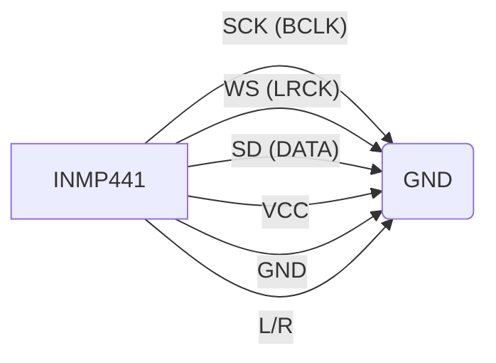

# 🎤 INMP441 Omnidirectional I2S Microphone

## 📋 Visão Geral

O **INMP441** é um microfone MEMS omnidirecional de alto desempenho com saída digital I2S.
Perfeito para aplicações de vigilância de áudio, gravação de voz e detecção de som ambiente no projeto ESP32-S3.

> [!IMPORTANT]
> A interface I2S é digital, o que garante imunidade a ruídos analógicos e alta qualidade de captura.

---

## ⚙️ Especificações Técnicas

| Característica | Detalhe |
|----------------|---------|
| **Interface** | I2S Digital (24-bit) |
| **Sensibilidade** | -26 dBFS |
| **Resposta de Freq** | 60Hz - 15kHz |
| **SNR** | 61 dBA |
| **Consumo** | 1.4 mA |
| **Tensão** | 1.8V a 3.3V |

---

## 📍 Pinagem & Ligação (ESP32-S3)

| Pino INMP441 | Função | Conexão ESP32-S3 | Descrição |
|--------------|--------|------------------|-----------|
| **SCK** | Serial Clock | **GPIO 28** | Clock de bits (BCLK) |
| **WS** | Word Select | **GPIO 29** | Seleção de canal (LRCK) |
| **SD** | Serial Data | **GPIO 30** | Dados de áudio (DIN) |
| **L/R** | Canal Sel. | **GND** | GND = Canal Esquerdo (Padrão) |
| **VCC** | Power | **3.3V** | Alimentação |
| **GND** | Ground | **GND** | Terra |

> [!NOTE]
> Conectar L/R ao VCC seleciona o canal direito. Para mono/estéreo padrão, conecte ao GND.

---

## 🛡️ "Ataques" & Funcionalidades Suportadas

O módulo permite capacidades avançadas de "Audio Intelligence":

### 1. 🕵️ Escuta Ambiente (Silent Listener)

- **Descrição**: Monitoramento passivo de áudio ambiente.
- **Uso**: Analisar espectro de áudio para detecção de presença humana ou alarmes.

### 2. 📡 Transmissão de Áudio (Bugging)

- **Descrição**: Streaming de áudio capturado via UDP/WiFi.
- **Uso**: Transformar o ESP32 em um dispositivo de escuta remota.

### 3. 📉 Análise Espectral (FFT)

- **Descrição**: Decomposição de frequências em tempo real.
- **Uso**: Identificar padrões de som específicos (bips de segurança, digitação).

### 4. 🔊 Trigger por Nível (VOX)

- **Descrição**: Ativar gravação/funções apenas quando o som ultrapassa X decibéis.
- **Uso**: Economia de bateria e armazenamento (Gravação apenas quando há atividade).

---

## 📜 Diagrama Esquemático Simplificado

## ⚠️ Cuidados

- **Tensão**: Não exceda 3.6V.
- **Umidade**: O orifício do microfone (port) não deve ser obstruído ou molhado.
- **Ruído**: Mantenha longe de trilhas de alta frequência ou antenas RF para máxima clareza (embora I2S seja robusto).
